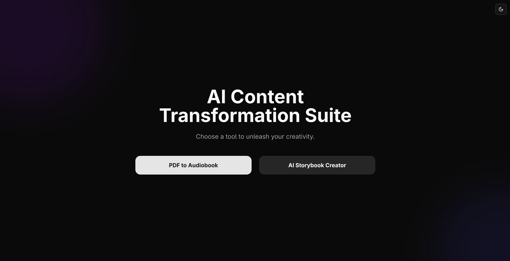
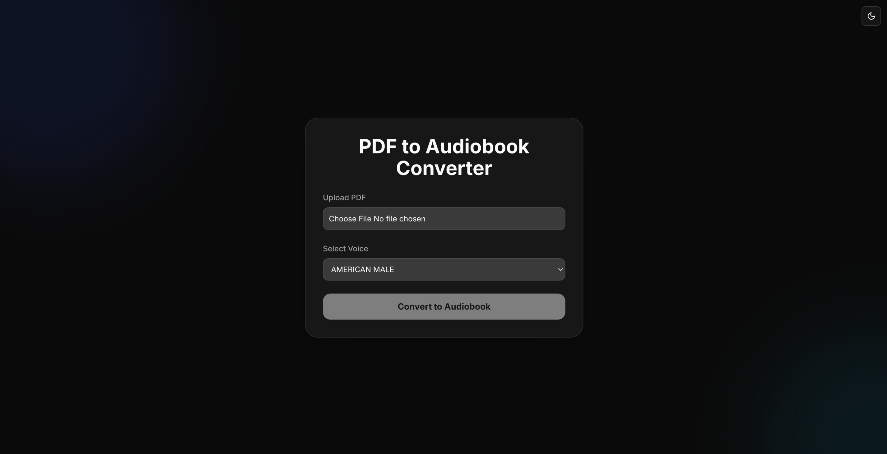
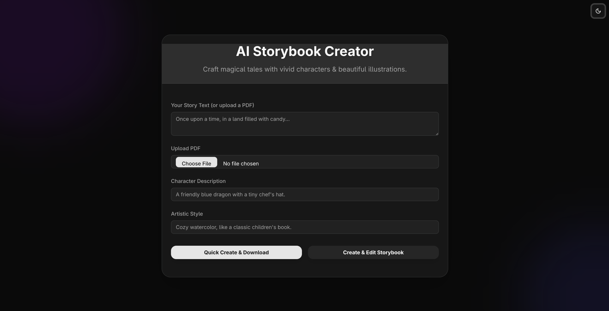

# AI Content Transformation Suite

The AI Content Transformation Suite is a full-stack application designed to transform various forms of content using artificial intelligence. It currently offers two main functionalities: converting PDF documents into audiobooks and creating AI-generated storybooks from text or PDFs.

## Features

- **PDF to Audiobook Converter**: Upload a PDF, select a voice profile, and convert it into an audiobook.
- **AI Storybook Creator**: Generate illustrated storybooks from provided text or PDF documents, with options to customize characters, artistic style, and edit scenes.
- **Theme Support**: Toggle between light, dark, and system default themes for a personalized user experience.

## Screenshots

> Below are some screenshots showcasing the app in action:

### 📌 Home Page  


### 📌 PDF to Audiobook  


### 📌 AI Storybook Editor  



## Technologies Used

### Frontend
- **Next.js** – React framework for server-side rendering and static generation
- **React** – UI library
- **Tailwind CSS** – Utility-first CSS framework
- **next-themes** – Theme management

### Backend
- **Python** – Main backend language
- **FastAPI** – High-performance API framework
- **Redis** – Caching and session management
- **Google Cloud APIs** – For TTS and AI image generation

### Infrastructure
- **Docker** – Containerization
- **Docker Compose** – Multi-container setup

## Setup

1. **Clone the repository**
    ```bash
    git clone https://github.com/your-username/ai_content_suite.git
    cd ai_content_suite
    ```

2. **Environment Variables**
    In `backend/.env`:
    ```env
    GOOGLE_API_KEY=your_google_api_key_here
    ```

3. **Run with Docker Compose**
    ```bash
    docker-compose up --build
    ```

4. **Access the app**
    Open: `http://localhost:3000`

## Project Structure
- `backend/` – FastAPI backend
- `frontend/` – Next.js frontend
- `screenshots/` – Project screenshots
- `docker-compose.yml` – Multi-service Docker setup

## Contributing
Pull requests are welcome.

## License
[MIT License](LICENSE)
